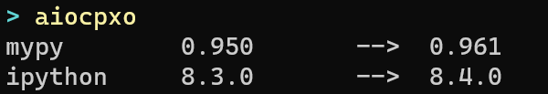
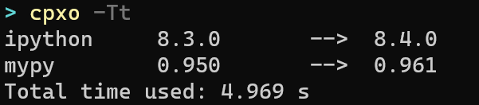

# Check pipx outdates

## What it does
Check which pipx installed top level packages are outdated.

A fun little demo for  threading, asyncio with subprocess.






## Usage

Build with poetry and install with pipx
```
# Build with poetry
poetry build

# Install with pipx
pipx install ./dist/aiocpxo-X.X.X.whl


# Use it
aiocpxo

# or
cpxo -Tt

# For help
cpxo --help
```
